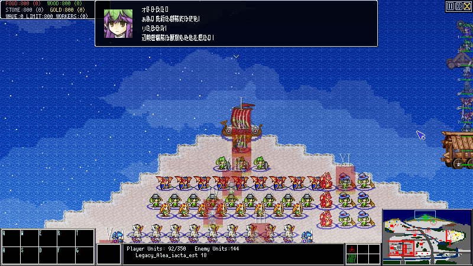
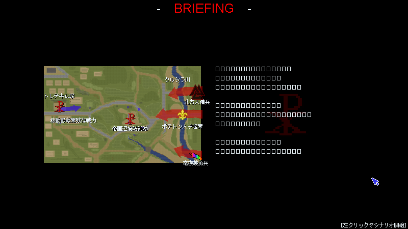
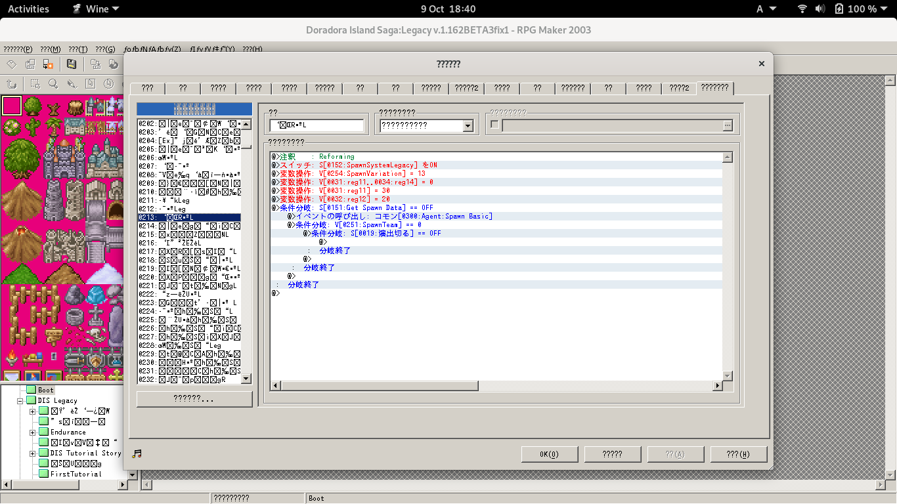

# Linuxで2003MPを使う / Use 2003MP on Linux  
## はじめに  
そもそも本家RPGツクール2003はWindowsのみでサポートされているツールである。  
またtpc等2003MPの関連ツールはWindowsの環境にかなり依存した作りになっている。  
それでも実はWineで動かして使うことができる。  
ほぼ需要はないと思われるが、物好きのために一応メモを残しておく。  
筆者の利用しているディストリビューションはDebian GNU/Linux 11だが、  
どうせWineを使うことになるのでディストリビューションの差異は大して関係ないだろう。
  
## 2003MPで遊ぶ
筆者の記憶では、32bit版は何某かの理由で起動しなかった(もしかすると単にWineのprefixの問題かもしれない)  
が、64bit版は普通にインストールしたそのままのWineで起動してやれば動く(最近のwineは確か起動した時点で64bitのprefixを利用しているはずである)。  
こんな記事を読んでいる人に対してはもはや書く必要がないかもしれないが、  
apt-getなりなんなりでwineをインストールしてゲームディレクトリに移動して  
`wine RPG_RT.exe`  
これで普通に動く。  
テストプレイモード(Ctrl壁抜けができたりする)で遊びたい場合は  
`wine RPG_RT.exe TestPlay`  
これでテストプレイ起動ができる。Winのコマンドラインからの起動と同じである。  
  
より簡単な方法として、Steam経由で起動してしまうという方法がある。  
LinuxでSteamのゲームを遊ぶのであればWineで環境をごちゃらせるより、こちらのほうが面倒が少ないためおすすめできる。  
うろ覚えだがprefixの切り替え等も勝手にやってくれる。  
  
### しかし日本人ユーザーにとってはなかなか厳しい大問題がある  
まず、RPG_RT.exeのデフォルトフォントであるMSゴシックとMS明朝がWine環境には存在していないため、  
$GAMEDIR/font/に同梱されていないフォントは表示時に崩れてしまう。  
  
そして文字エンコーディングの都合と思われるが、[RPG_RT.iniの文字エンコーディングがsjis指定の場合](/Misc/RPG_RT.ini.md)、仮にフォントが同梱されていたとしても、文章表示機能を用いた日本語表現がこのように崩壊してしまう：  
  
また、フォントによっては文字列ピクチャ表示を用いてもこのように２バイト文字が未対応に状態で表示されてしまう:  
  
  
自分でインストールしたWineの場合は設定や代用フォント導入等でどうにかなる目があるかもしれないが、  
少なくとも筆者が代用日本語フォントを導入した程度では是正されなかった。  
そのため残念ながら、現状ではLinuxで遊ぶ側に回るのは英語作品以外あまりおすすめできない。  
  
## 2003MPで作る
上述した都合もあり、Linux上で2003MPのゲームを遊ぼうとするのはよほどの好き者だけだろう。  
では、2003MPで作る場合はどうだろうか。  
筆者としては、製作にあたっては場合は一概にLinux環境を否定することはできないと考えるが、色々と難しい部分があるのも確かである。
例えばエディタもwine経由で動かすことはできる。**が、**
  
画面がこのようなことになってしまうためおすすめできない(wine設定をいじくればなんとかなるかもしれないが)。  
英語版環境であれば文字化けは解決するが、Discordで更新されているエディタ側最新版はたまに日本語だけが先行していたりするため結局不便である。  
  
しかしながら、完全にTPC化して制作作業を行うのであればWinよりLinux環境の方が何かと好都合な場面も出てくる。  
TPCのみならず、java scriptが正式に導入され、そのうちにC++プラグインの導入もなされるであろうことに鑑みれば、なおさらである。  
拙作DIS:LegacyもTPC化が進んでからは基本的にDebian上で作業している。  
コンパイラの役目を果たすtpc.exeさえ機能するのであれば、十分開発作業は可能である。  
  
### ということでためしにtpc.exeをwineで叩いてみよう  
そうするとおそらくこのようなエラーが出る。  
```
0009:err:module:fixup_imports_ilonly mscoree.dll not found, IL-only binary L"tpc.exe" cannot be loaded
0009:err:module:LdrInitializeThunk Importing dlls for L"Z:\\home\\tkooler\\yourgamedir\\yoursource\\tpc.exe" failed, status c000013
5
```
mscoree.dllが足りないと言われているが、mscoree.dllをどこかから持ってきても事態は解決しない。  
思い出してほしい、2003MPはかつて32bitだった。  
ゲーム実行ファイルは確かに64bit化された。しかしながら、補助ツールであるtpc.exeについては32bitのままなのである。  
そう、**tpc.exeを起動する際は32bitのprefixに切り替えないと立ち上がらない**のである。  
**Wine個別のprefix設定は別にググれば出てくると思うので省略する**。  
  
既に32bit版のprefixを作ったものとしよう。  
tpc.exe起動の前にどうにかしてこんな感じでprefix切り替えをする  
`export WINEPREFIX=~/.local/share/wineprefixes/32bitTest;`  
そうすると普通に立ち上がってくれる。  
逐一手動で切り替えるのはアホらしいので、てきとうなaliasなり何なりをbashrcに書いてtpc立ち上げ前後でprefixを切り替えるようにするとよいだろう。
  
### wineを介したtpc.exeでのコンパイル
ターミナル文字エンコードの問題だと思われる(筆者の環境では同じ事象がWindows Power Shellやgitbash経由でも発生する)が、  
tpcファイルをコンパイルするにあたって、tpc.exeが出力する２バイト文字はすべて崩壊して"?"に置き換えられてしまう。  
そのため、コンパイル時は-enオプションをつけると良いだろう。  
  
tpcを叩くバッチファイルの実行に際しては、一般的なwineでのbat実行と同じく、  
`wine start.exe compileUrProject.bat`  
このようにbatファイルを呼び出せばWindows用のコンパイルバッチをそのまま使い回すことができる。  
まあ、shからwineを呼んで処理するかどうかは環境構築次第のお好みだろう。  

------------------------------------------------

備忘録なので内容としてはこんなものである。  
[おまけとして筆者が使っているvimシンタックスファイルをつけておく。](./appendix/tpc.vim)  
複数行コメントアウトの処理がおかしかったり一部のオペランドが抜けていたりと不完全なので、好みに合わせて修正してほしい。  

